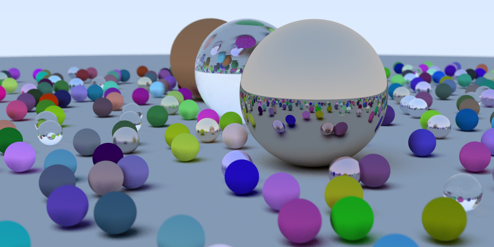

# Ray Tracing in One Weekend, but in rust.



A ray tracer written in rust, using Peter's Shirley book as guide: 
[https://raytracing.github.io/books/RayTracingInOneWeekend.html](https://raytracing.github.io/books/RayTracingInOneWeekend.html)


### Notes and TODO's: 

1. Why do we need this type of MaterialClone trait? And also why cant we call `clone` on `geometry.rs` and can only call `clone_box`? 

```
pub trait  MaterialClone {
    fn clone_box(&self) -> Box<dyn Material>;
}

impl<T> MaterialClone for T
where
    T: 'static + Material + Clone,
{
    fn clone_box(&self) -> Box<dyn Material> {
        Box::new(self.clone())
    }
}

impl Clone for Box<dyn Material> {
    fn clone(&self) -> Box<dyn Material> {
        self.clone_box()
    }
}
```
2. Fix bug on thread tilling logic.